<h3><code>soham@github ~ $ ./contributions.sh</code></h3>

  

<h3><code>soham@github ~ $ whoami</code></h3>
<table>
  <tr>
    <td valign="top"></td>
    <td valign="top"></td>
  </tr>
</table>

 

##  **Flagship Projects**

| **AI Crisis Forecasting** | **RecSys Engine** |
|:---:|:---:|
|  |  |
| 🌍 Global conflict & disaster prediction system using LSTM/XGBoost. | 🛍️ Hybrid recommendation system (Content + Collaborative filtering). |
| `Time-Series` `Forecasting` `Docker` | `Recommender` `NLP` `Production-Ready` |

 

| **Resume Scanner ATS** | **Data Autopsy System** |
|:---:|:---:|
|  |  |
| 📄 NLP-powered resume parser and job description matcher with ATS scoring. | 🏥 Automated EDA and data quality profiling tool for rapid analysis. |
| `NLP` `Spacy` `Streamlit` | `EDA` `Automated-Reporting` `Pandas` |

 

| **Smart City Traffic** | **Log Analyzer X** |
|:---:|:---:|
|  |  |
| 🚦 AI-driven traffic optimization and density prediction. | 📊 Server log anomaly detection and visualization dashboard. |
| `Optimization` `Computer-Vision` | `Anomaly-Detection` `DevOps` |

 

&nbsp;&nbsp;

&nbsp;&nbsp;

##  **Tech Arsenal**

### 🤖 AI/ML & Data Science

### 🌐 Web & Deployment

##  **GitHub Analytics**

  
  
   
  

 

    

  <i>Portfolio Optimization Status: **Production Grade** | Last Refined: Feb 2026</i>

<!-- Animated Footer -->

